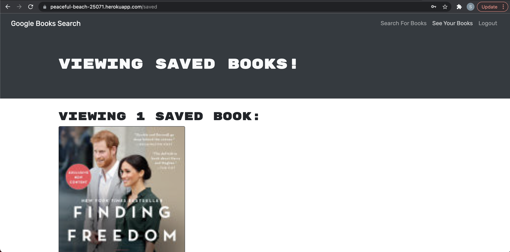

# Book Search Engine

## Description

You can make a book search and added it to your profile. This app uses GraphQL to make all the requests from the back end to the front end.

## Book Search Engine screenshot

## Contribute

You can send me your request.

## Questions

[https://github.com/salvadordiaz1222](https://github.com/salvadordiaz1222)
salvador.diaz1222@gmail.com
You can reach me at my GitHub profile or by email. I usually respond within a day.
